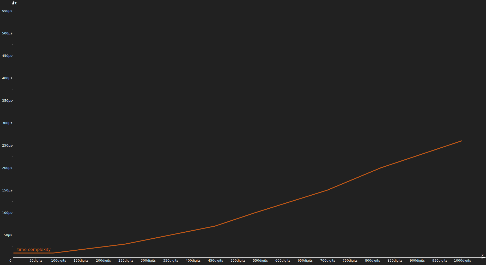

<h1 align="center">n-digit-token</h1>

<p align="center">Generate a cryptographically secure pseudo-random token of N digits.</p>

<p align="center">
  <a href="#comparisons">
    
  </a>
  <a href="#comparisons">
    
  </a>
  <a href="https://repos.almasi.dev/n-digit-token/coverage">
    
  </a>
  <a href="#performance">
    
  </a>
  <a href="https://www.npmjs.com/package/n-digit-token">
    = 10.4.0"/>
  </a>
</p>

## Quick start

`gen(n)` where `n` is the desired length/number of digits.

``` javascript
const { gen } = require('n-digit-token');

const token = gen(6);
// => '681485'
```

## Summary

This tiny module generates an n-digit cryptographically strong pseudo-random token in constant time and avoids modulo bias.

### Modulo bias

The `2.x` version of the `n-digit-token` algorithm __does avoid__ [modulo bias](https://en.wikipedia.org/wiki/Fisher%E2%80%93Yates_shuffle#Modulo_bias) therefore providing high precision even for larger tokens.

### Performance

This algorithm runs in `O(1)` constant time for up to a `100` digit long token sizes
_(and I don't know why you would ever want larger tokens)_.

### Comparisons

| Algorithm        	| Cryptographically strong? 	| Avoids modulo bias? 	|
|------------------	|---------------------------	|---------------------	|
| average RNG      	| :x:                       	| :x:                 	|
| crypto.randomInt 	| :x:                       	| :heavy_check_mark:  	|
| n-digit-token    	| :heavy_check_mark:        	| :heavy_check_mark:  	|

As of `n-digit-token@2.x` February 2021

## Details

- [Quick start](#quick-start)
- [Summary](#summary)
  - [Modulo bias](#modulo-bias)
  - [Performance](#performance)
  - [Comparisons](#comparisons)
- [Details](#details)
- [Background](#background)
- [Algorithmic properties](#algorithmic-properties)
  - [Performance](#performance-1)
    - [Entropy](#entropy)
    - [Libuv's threadpool](#libuvs-threadpool)
    - [Time complexity chart](#time-complexity-chart)
  - [Memory usage](#memory-usage)
- [Detailed usage](#detailed-usage)
- [Options](#options)
  - [options.skipPadding](#optionsskippadding)
    - [Generating digits & padding](#generating-digits--padding)
      - [Generate a single-digit decimal](#generate-a-single-digit-decimal)
      - [Generate a multi-digit decimal](#generate-a-multi-digit-decimal)
    - [Equally random](#equally-random)
      - [Why not just discard numbers that start with 0?](#why-not-just-discard-numbers-that-start-with-0)
      - [How much discarded](#how-much-discarded)
    - [One-time tokens often start with zeros](#one-time-tokens-often-start-with-zeros)
    - [Using skipPadding](#using-skippadding)
      - [Example](#example)
  - [options.returnType](#optionsreturntype)
    - [Return type compatibility](#return-type-compatibility)
    - [Examples](#examples)
  - [Using returnType with skipPadding](#using-returntype-with-skippadding)
    - [Compatibility table](#compatibility-table)
    - [Examples](#examples-1)
  - [options.customMemory](#optionscustommemory)
  - [options.avoidModuloBias (deprecated)](#optionsavoidmodulobias-deprecated)
- [Test](#test)
  - [Scripts](#scripts)
- [Dependencies](#dependencies)
  - [Running in browser](#running-in-browser)
- [Support](#support)
- [License](#license)

## Background

I was looking for a simple module that generates an n-digit token that could be used for 2FA among others and was surprised that I couldn't find one that uses a cryptographically secure number generator ([CSPRNG](https://en.wikipedia.org/wiki/Cryptographically_secure_pseudorandom_number_generator))

If your application needs cryptographically strong pseudo random values, this uses `crypto.randomBytes()` which provides [cryptographically strong](https://nodejs.org/api/crypto.html#crypto_crypto_randombytes_size_callback) pseudo-random data.

## Algorithmic properties

### Performance

The `n-digit-token` algorithm executes with `O(1)` time complexity, i.e. in constant time when `length <= 100`. This makes `n-digit-token` suitable for cryptographic use cases.

Normally, you would never need to generate tokens that are above a few digits, such as 6 or 8, so this threshold is already an overkill.

The expected execution time of generating a token where `length <= 1000` is still within `1 ms` on a modern CPU.

#### Entropy

Note that for a cryptographic PRNG the system's entropy is an important factor. The `n-digit-token` function will `wait` until there is sufficient entropy available as it is uses the `crypto.randomBytes()` method.

This should normally not take longer than a few milliseconds unless the system has just booted very recently.

You can read more about this [here](https://nodejs.org/api/crypto.html#crypto_crypto_randombytes_size_callback).

#### Libuv's threadpool

As `n-digit-token` is dependent on `crypto.randomBytes()` it uses libuv's threadpool, which can have performance implications for some applications. Please refer to the documentation [here](https://nodejs.org/api/crypto.html#crypto_crypto_randombytes_size_callback) for more information.

#### Time complexity chart

To test the consistency of the speed of the algorithm on a modern CPU, `n-digit-token` was called to generate a token of length `1` to `1000` on an `AMD EPYC 7000` clocked at `2.2 GHz`. This test was repeated a `1000` times on different occasions and the times were averaged.

The below chart represents the time it takes (in nanoseconds) to generate a token of length `x`:

<p align="center">
  Time taken per token length
</p>

[](https://raw.githubusercontent.com/almasen/n-digit-token/c3a66bbf99516da413a757433c6ed2ee9d8e76c4/img/time-complexity.svg)

<p align="center">
  <small>
  y-axis shows time in nanoseconds / token length (AMD EPYC 7000 @ 2.2 GHz)
  </small>
</p>

From this test and the diagram above it is shown that for up to `~100` digits the running time is constant, for larger tokens, the time taken is growing by gradually more.

As this algorithm is not designed to be used as a pseudo random digit stream, but to generate fixed-size tokens, this matches expectations. That said, it would be technically feasible to generate a large number of short tokens via this module that still runs in constant time, and then concatenate the tokens to a large stream.

### Memory usage

By default the algorithm ensures modulo precision whilst also balancing performance and memory usage.

In order to achieve `O(1)` running time for lengths `1-100` the algorithm will attempt to reserve memory linearly scaling with the desired token length.

For token sizes between `1-32` the maximum used memory will not exceed `128 bytes`.
For insanely large tokens, such as a `1000` digits, the max memory by default is still within `1 kibibyte`.

## Detailed usage

`gen()` is just a shorthand for `generateSecureToken()` use whichever you prefer.

``` javascript
const { gen, generateSecureToken } = require('n-digit-token');

const token = gen(6);
// => '681485'

const anotherAuthToken = generateSecureToken(6);
// => '090188'

const anEightDigitToken = gen(8);
// => '25280789'
```

## Options

There are a few supported customisation options for the algorithm for some highly specific use cases.

:exclamation: Most users will **NOT** need to change any of these options. :exclamation:

|                      	| optional           	| default value 	|
|----------------------	|--------------------	|---------------	|
| options.returnType   	| :heavy_check_mark: 	| `'string'`      	|
| options.skipPadding  	| :heavy_check_mark: 	| `false`         	|
| options.customMemory 	| :heavy_check_mark: 	| N/A           	  |

### options.skipPadding

Padding is an important concept regarding this algorithm.

If you aim to change this option, please make sure to read both [skipPadding](#optionsskippadding) & [returnType](#optionsreturntype) carefully to avoid unintended consequences.

#### Generating digits & padding

##### Generate a single-digit decimal

Since this algorithm aims to generate decimal numbers from a cryptographically strong random byte stream, the distribution of the generated numbers will *mostly* follow a natural distribution.

This means that if you generate a single digit token, you are *mostly* equally likely to hit any of the decimal numbers `0-9` inclusive. Note that, you can therefore get zero as a result *(as you should be able to do so)*.

For example, calling `gen(1)` can result in the decimal number `9` and the token `'9'` *(since the default return type is string)*:

``` javascript
const token = gen(1);
// internally:
1) length=1 means max=9               (-> max=9)
2) roll a number between 0-9          (-> rolls 9)
3) convert it to string               (-> '9')
4) return
=> '9'
```

##### Generate a multi-digit decimal

On the other hand, for multi-digit tokens, you will be *mostly* equally likely to hit any of `0-99` meaning that you **can still hit a single digit decimal number**.

For example, calling `gen(2)` can internally result in the decimal number `9` again, since it is a valid random number on the range `0-99`. However, since the user wanted to receive a 2-digit token, the returned token string will need to be padded by a `0`. Therefore, you will get `'09'` as the token.

``` javascript
const token = gen(2);
// internally:
1) length=2 means max=99              (-> max=9)
2) roll a number between 0-99         (-> rolls 9)
3) convert it to string               (-> '9')
4) pad if less than desired length    (-> '09')
5) return
=> '09'
```

#### Equally random

Now you should see why it may be necessary to pad the generated numbers.

##### Why not just discard numbers that start with 0?

You might be wondering, why can't we just discard numbers that start with zeros rather than to pad them.

Whilst it would be a valid approach to say that we could just discard any numbers that are lower than the desired number of digits, it would defeat the purpose of using a cryptographically strong seed.

In order to provide the closest to a truly random distribution of generated numbers, it is essential that the minimum possible value is `0` as the CSPRNG functions provide a pseudo random stream of binary data.

##### How much discarded

Furthermore, just think about in how many cases you would need to _re-roll_ for larger tokens.
For example for `gen(6)` in order to have a `6-digit` number any numbers below `100000` would have to be discarded. That's `10000` or `10 ** (length-1)` cases (`0-99999`).

``` javascript
const token = gen(6);
=> '009542'    // 10% chance to discard
```

Besides, there are already many average random number generators where you can specify an integer range for both min and max that focuses less on precision.

#### One-time tokens often start with zeros

As you may have noticed if you use 2FA, many one time tokens do start with zeros. If they use a bit-stream it has a `~10%` chance and this should also explain why `n-digit-token` can return a token starting with zero.

#### Using skipPadding

Setting `options.skipPadding=true` will skip padding any tokens that are shorter than the input length.

Therefore, `n-digit-token` may return varied token lengths!

**:warning: Varied token lengths :warning:**

Make sure your application is able to handle that the returned token may be of different lengths.

##### Example

If `skipPadding=true` then `length` will be the **maximum** returned token length.

``` javascript
const { gen, generateSecureToken } = require('n-digit-token');

const token = gen(6, { skipPadding: false }); // equivalent to gen(6)
=> '030771'

const token = gen(6, { skipPadding: true });
=> '30771'
```

### options.returnType

By default the algorithm returns the generated token as a `string`.

This option allows you to customise the return type of the generated token.

You can choose from:
- `'string'`
- `'number'` (i.e. `'integer'`)
- `'bigint'`

:warning: Note that **only** `string` guarantees a fixed length output! :warning:

If you aim to change this option, please make sure to read both [skipPadding](#optionsskippadding) & [returnType](#optionsreturntype) carefully to avoid unintended consequences.

#### Return type compatibility

Please refer to the below table to see the compatibility of the return types:

| return type / token length 	| 1-15               	| 16+                	|
|----------------------------	|--------------------	|--------------------	|
| `'string'`                 	| :heavy_check_mark: 	| :heavy_check_mark: 	|
| `'number'` _(integer)_     	| :heavy_check_mark: 	| :x:                	|
| `'bigint'`                 	| :heavy_check_mark: 	| :heavy_check_mark: 	|

#### Examples

``` javascript
const { gen, generateSecureToken } = require('n-digit-token');

const token = gen(6);
=> '440835'

const anotherStringToken = gen(16, { returnType: 'string' });
=> '8384458882874956'

const aNumberToken = gen(6, { returnType: 'number' });
=> 225806

const aBigIntToken = gen(16, { returnType: 'bigint' });
=> 9680644450112709n
```

### Using returnType with skipPadding

Some return types will automatically skip padding.

For example, if the token is returned as a `number` there is no way to pad with zeros if shorter.

In other words, some return types require and automatically set `skipPadding=true`.

#### Compatibility table

| return type / padding 	| skipPadding 	| padWithZeros 	|
|-----------------------	|-------------	|--------------	|
| `'string'`             	| optional    	| default      	|
| `'number'`         	    | required    	| impossible   	|
| `'bigint'`             	| required    	| impossible   	|

#### Examples

``` javascript
const { gen, generateSecureToken } = require('n-digit-token');

// the below is equivalent to gen(6) i.e. default
const token = gen(6, { returnType: 'string', skipPadding: false });
=> '012345'

const token = gen(6, { returnType: 'string', skipPadding: true });
=> '12345'

// the below is equivalent to gen(6, { returnType: 'number' });
const token = gen(6, { returnType: 'number', skipPadding: true });
=> 12345

// the below is equivalent to gen(6, { returnType: 'bigint' });
const token = gen(6, { returnType: 'bigint', skipPadding: true });
=> 12345n
```

### options.customMemory

This is a highly advanced option. Please read [memory usage](#memory-usage) before proceeding.

If you need to limit the used memory, you can do so by specifying the amount of bytes you can allocate via the `options.customMemory` option.

For example, if you can only allocate `8 bytes`, you could do the following:

``` javascript
const { gen, generateSecureToken } = require('n-digit-token');

const token = gen(6, { customMemory: 8 });
```

**:warning: Performance implications :warning:**

Please note that both **giving too few or too much memory** to the algorithm **may negatively impact performance** by a considerable amount.

If the application detects unsuitable amount of memory, it may warn you in the debug console, but will continue to execute.

### options.avoidModuloBias (deprecated)

This setting has been deprecated as of `n-digit-token@v2.x` since the algorithm avoids modulo bias by default. Therefore, the use of this option is now unnecessary and ignored by the application.

## Test

Install the devDependencies and run `npm test` for the module tests.

### Scripts

- `npm test` to see interactive tests and coverage
- `npm run build` to compile JavaScript
- `npm run lint` to run linting

## Dependencies

`0 dependencies`

This package is solely dependent on the built-in `nodeJS/Crypto` module.

### Running in browser

You may have success running this module with [crypto-browserify](https://www.npmjs.com/package/crypto-browserify), but note that this is intended for server-side use and therefore in-browser use is not natively supported.

## Support

Please consider supporting `n-digit-token` with a [one-time](https://www.paypal.me/almasen) or [GitHub Sponsors donation](https://github.com/sponsors/almasen) as this project takes considerable amount of time and effort to develop and maintain.

## License

[MIT © Daniel Almasi](https://github.com/almasen/n-digit-token/blob/master/LICENSE)
